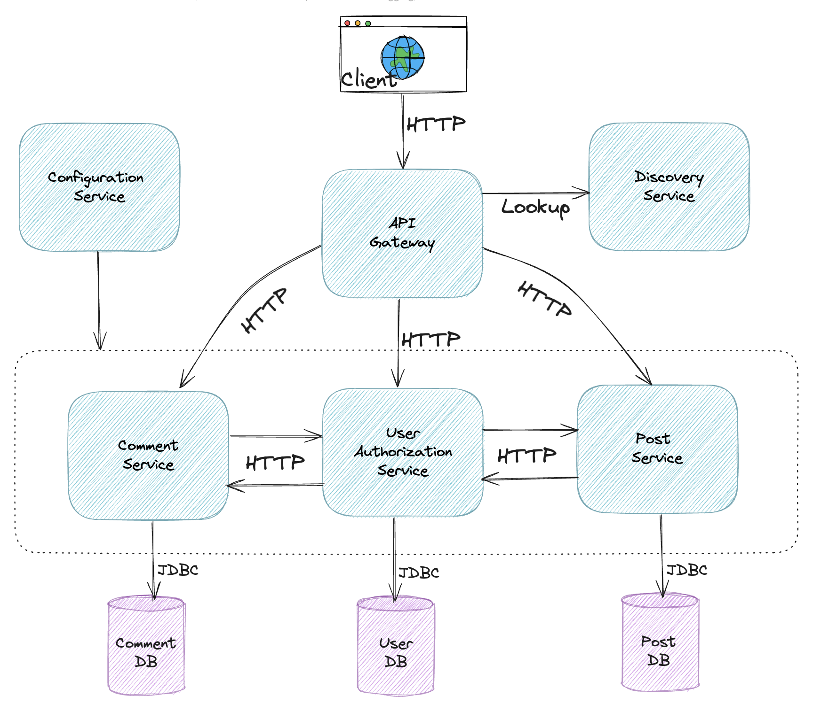
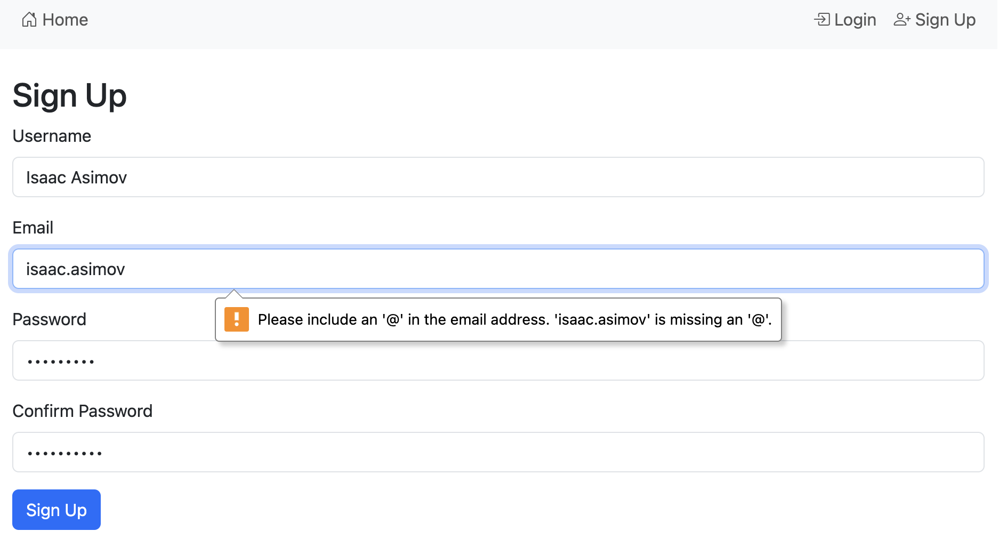
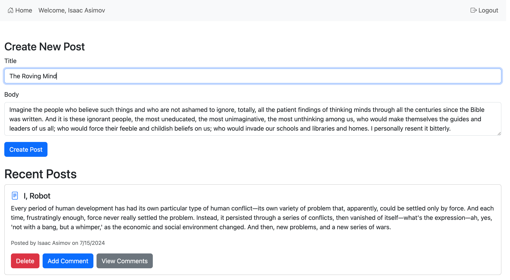
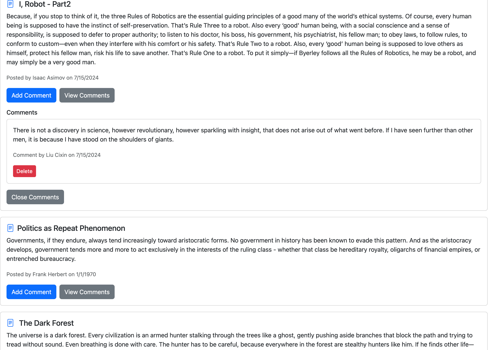
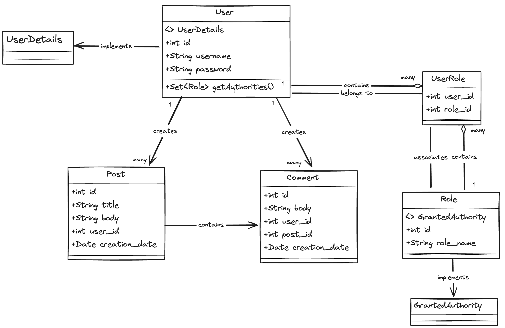
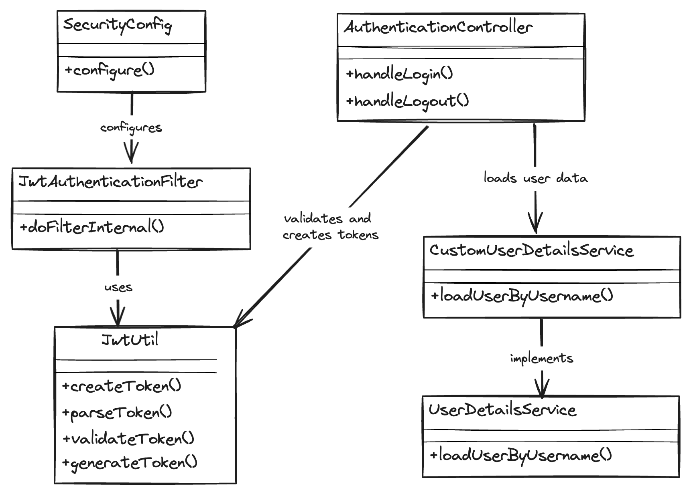
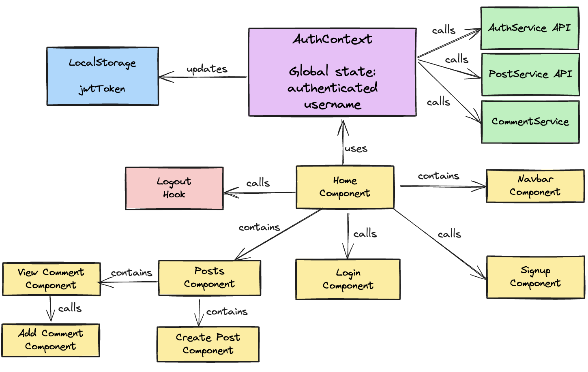

# Blog Application: Microservice Orchestration

A Java microservices blog application with a React frontend, Spring Cloud Gateway, and three Spring Boot business services. Runtime discovery uses platform DNS and configuration comes from environment/secret injection; Eureka and Spring Cloud Config are no longer runtime dependencies.

## Architecture


## Features

1. **Home Page:** Displays a list of all posts by all users, ordered by the most recent.
2. **Signup Page:** Collects basic information to register a new user.
3. **Login Page:** Authenticates users via JWT token authentication, enabling them to comment on existing posts and create new posts.
4. **Add Post Page:** Allows users to create new posts.
5. **Add Comment Page:** Enables users to comment on posts posted by themselves or other users.
6. **Content Management:** Users can delete their own posts and comments.

## Screenshots
**Signup**
</br></br>

**CreatePost**
</br></br>

**Comment**


## Components



1. **API Gateway:** Routes same-origin `/api` requests to internal services.
2. **Authorization Service:** Handles authentication and token issuance.
3. **Post Service:** Manages blog posts, including creation, retrieval, and owner-only deletion.
4. **Comment Service:** Manages comments, including creation, retrieval, and owner-only deletion.
5. **Blog Client:** Builds to static assets served by Nginx, which proxies `/api` to the gateway.

## JWT and Spring Security Architecture



1. **SecurityConfig:** Configures security settings for the application.
2. **JwtAuthenticationFilter:** Intercepts requests to validate JWT tokens.
3. **JwtUtil:** Handles creation, parsing, and validation of JWT tokens using the jjwt library.
4. **CustomUserDetailsService:** Loads user-specific data.
5. **AuthenticationController:** Provides tokens in responses for successful login requests.

## React Application Structure



1. **App Component (`App.js`):**
   - Root component
   - Sets up routing
   - Wraps the application with AuthProvider

2. **Authentication Context (`AuthContext.js`):**
   - Manages global authentication state
   - Provides login, logout, and signup functions
   - Checks and maintains authentication status

3. **API Services:**
   - `userAuthAPI.js`: Handles authentication-related API calls
   - `postAPI.js`: Manages post-related API calls
   - `commentAPI.js`: Handles comment-related API calls

4. **Components:**
   - `Navbar.js`: Navigation bar with conditional rendering based on auth status
   - `Home.js`: Main page, displays posts for authenticated users
   - `Login.js`: Handles user login
   - `SignUp.js`: Manages user registration
   - `PostList.js`: Displays list of posts with options to add/view comments
   - `AddComment.js`: Form for adding new comments
   - `ViewComments.js`: Displays comments for a specific post

## Database

- The application was developed using MySQL 8.4.0.
- Flyway is used to ensure that your database schema is automatically created and managed over time.

## Tech Stack

- Java
- Spring Boot
- Spring Data JPA
- Spring Security
- Spring MVC
- React
- MySQL
- Maven
- Docker

## Local run

Requirements: Docker with Compose. Copy `.env.example` to `.env` and replace every example value, then run:

```bash
docker compose up --build -d
docker compose ps
./scripts/smoke-test.sh
```

Open <http://localhost:3000>. Only the frontend is published; it forwards `/api` to the internal gateway. Stop the stack with `docker compose down`. Add `-v` only when you intentionally want to delete local MySQL data.

## Verification

Run `./scripts/verify.sh` for clean independent backend tests and the frontend test/build. See `AGENTS.md` and `docs/CHANGELOG.md` before continuing implementation.

